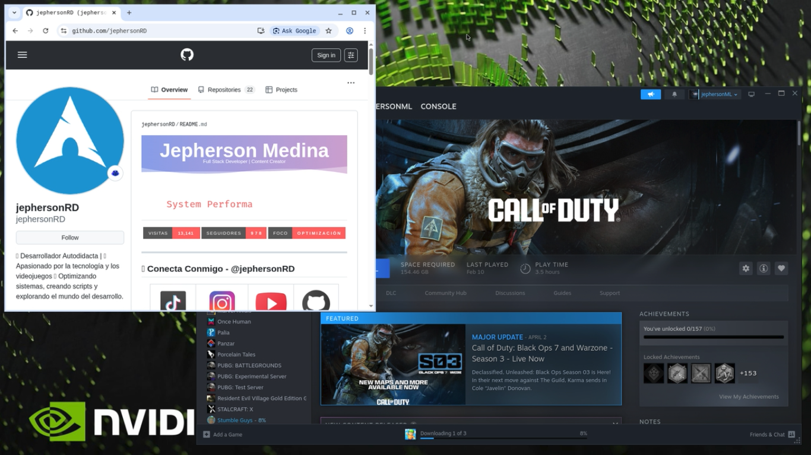
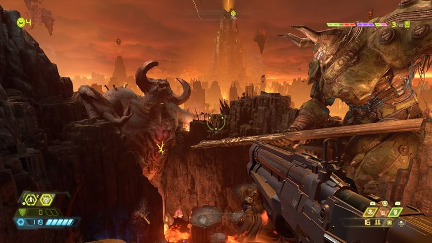
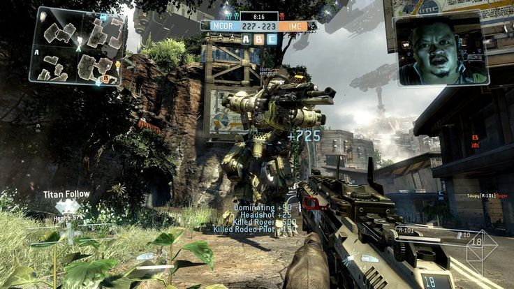
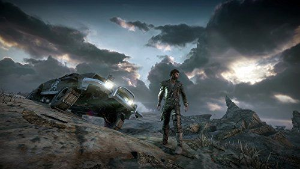
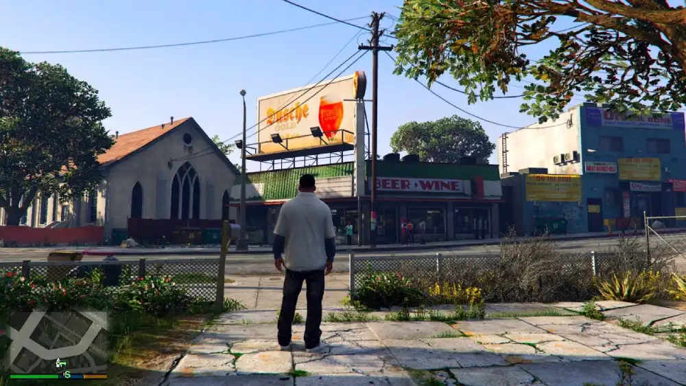

<div align="center">

# ☁️ Colab Cloud Gaming
### ⭐ ¡Si te fue útil, no olvides dejar una estrella!

### 🎮 Ejecuta Steam y juega en la nube con Google Colab


[](https://colab.research.google.com/github/kmille36/Colab-Cloud-Gaming/blob/main/ColabSteam.ipynb)
[](https://github.com/kmille36/Colab-Cloud-Gaming/stargazers)
[](https://github.com/kmille36/Colab-Cloud-Gaming/network/members)
[](https://github.com/kmille36/Colab-Cloud-Gaming/issues)
[](https://github.com/kmille36/Colab-Cloud-Gaming/blob/main/LICENSE)

---

> ✅ **ACTUALIZADO (10/01/2026):** ¡Steam funciona correctamente!

[📺 Ver Demostración en YouTube](https://youtu.be/zkxQ1IQ--7M?si=avkAjTEgBRfEpBRc)

</div>

---

## 🚀 Inicio Rápido

```bash
from google.colab import drive
drive.mount('/content/drive')
!wget -q https://github.com/kmille36/Colab-Cloud-Gaming/raw/refs/heads/main/ColabSteam
!chmod +x ColabSteam
!./ColabSteam
```

### ✅ Compatible con Steam y Navegador



---

## 📋 Requisitos

| Software | Descripción |
|----------|-------------|
| 🔗 **Tailscale** | Conexión segura de red |
| 🌙 **Moonlight** | Cliente de streaming |

---

<div align="center">

## 📺 TUTORIAL

[](https://youtu.be/zkxQ1IQ--7M?si=avkAjTEgBRfEpBRc)

**[▶️ Ver Tutorial Completo en YouTube](https://youtu.be/zkxQ1IQ--7M?si=avkAjTEgBRfEpBRc)**

</div>

## 💻 Especificaciones de la Máquina Virtual

| 🎮 **GPU** | ⚡ **CPU** | 💾 **RAM** | 🖥️ **Sistema Operativo** |
|:----------:|:----------:|:----------:|:------------------------:|
| **NVIDIA Tesla T4** | **Intel Xeon**<br>2 Cores @ 2.0GHz | **12.67 GB** | **Ubuntu 22.04.4 LTS** |

</div>

### 🎮 Juegos que corre esta PC

# - Doom Eternal


# - Metal Gear Solid V: The Phantom Pain


# - Titanfall 2


# - Wolfenstein II: The New Colossus


# -Sniper Elite 4


# - Mad Max


# - Batman: Arkham Knight


# - Rise of the Tomb Raider


# - Grand Theft Auto V


# - Alien: Isolation


# - Resident Evil 2 (Remake)


# - Devil May Cry 5


# - BioShock Infinite


# - Hades


# - Forza Horizon 4


---

## ⚙️ Configuración

| Función | Estado |
|---------|--------|
| Soporte de control en Moonlight | ✅ Funcional |
| Gamepad virtual | ❌ No disponible |
| Gamepad físico | ❌ No disponible |

🌐 **Interfaz web de Sunshine:** `https://[tu-ip-tailscale]:47990`

---

## 💾 Sistema de Respaldos

> Ahorra entre **50% y 75%** del tiempo de espera en tu próxima sesión.

### ¿Cómo funciona?

1. **Descarga e instala** tu juego de Steam/Epic u otra plataforma
2. **Compila los shaders** en el primer inicio (si es necesario)
3. **Realiza un respaldo** una vez que todo esté listo para jugar
4. **¡Listo!** La próxima vez podrás jugar instantáneamente

### 📤 Compartir respaldos entre cuentas de Drive

1. Comparte el enlace de descarga con la cuenta destino
2. Crea un acceso directo al archivo de respaldo en el Drive destino
3. ⚠️ **Importante:** El archivo `backup.tar.gz` no debe estar dentro de ninguna carpeta

---

## ⚠️ Recomendaciones Importantes

- ⏰ Verifica siempre el tiempo restante de uso
- 🔌 Desconéctate cuando no estés usando (el tiempo de 4 horas se reinicia cada 24 horas)
- 👀 No ocultes ni cambies de pestaña de Colab para evitar desconexiones
- 💿 El montaje de Drive es opcional — comenta el código con `#` si no lo necesitas

---

## 🐛 Solución de Problemas

> Si encuentras algún error, simplemente **vuelve a ejecutar el script**.

---

<div align="center">

### ⭐ ¡Si te fue útil, no olvides dejar una estrella!

Hecho con ❤️ para la comunidad gamer

</div>
